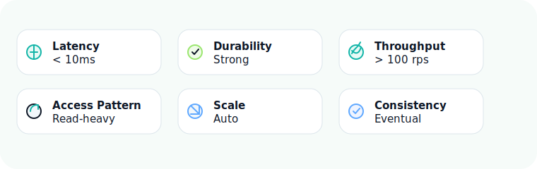
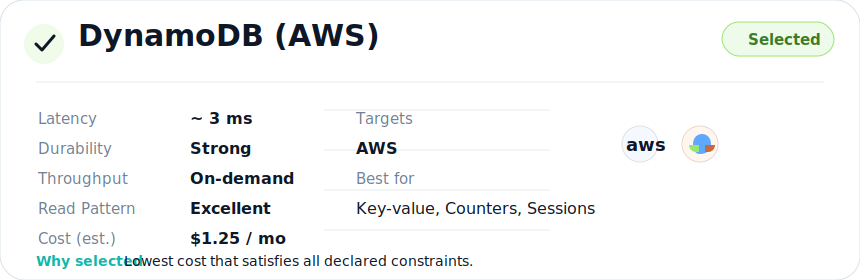
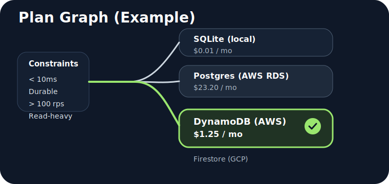
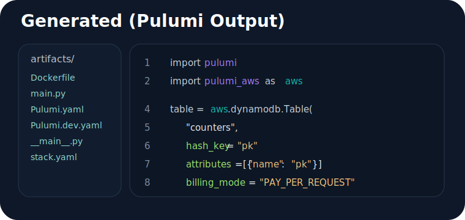

# How Skaal Works

Skaal keeps the application model stable and treats infrastructure selection as a planning problem. You do not rewrite the app when you move from local development to a cloud target. You change the catalog, the target, and the environment-specific secrets. Skaal handles the rest.

<div class="skaal-flow-grid">
  <section class="skaal-flow-card">
    
    <div markdown="1">

### 1. Declare the behavior you need

Use typed surfaces like `Map`, `Collection`, `BlobStore`, or `VectorStore`, then attach constraints with decorators such as `@storage`, `@function`, `@schedule`, and `@channel`.

The app code describes required behavior, not vendor-specific infrastructure.

    </div>
  </section>
  <section class="skaal-flow-card">
    
    <div markdown="1">

### 2. Load the environment catalog

Catalogs describe the backend options available for a target environment. A local catalog might expose SQLite and filesystem storage. An AWS catalog might expose DynamoDB, S3, Lambda, and EventBridge.

That gives the solver a bounded search space grounded in real infrastructure capabilities.

    </div>
  </section>
  <section class="skaal-flow-card">
    
    <div markdown="1">

### 3. Solve for the cheapest viable path

The Z3-backed planner evaluates the declared constraints against the catalog and selects a backend mix that satisfies them. The output is a plan, not a guess: the chosen route is explicit, explainable, and target-aware.

This is the core Skaal trade. The solver owns infrastructure selection so your app code does not have to.

    </div>
  </section>
  <section class="skaal-flow-card">
    
    <div markdown="1">

### 4. Generate artifacts and run them

Once a plan exists, Skaal generates the runnable surface for the chosen target: Dockerfiles, runtime entry points, Pulumi programs, stack metadata, and local deployment outputs.

You can run locally, or deploy the same application model to AWS or GCP.

    </div>
  </section>
</div>

## The command loop

```bash
skaal plan --app myapp:app --catalog catalogs/local.toml
skaal build --app myapp:app --target local --catalog catalogs/local.toml
skaal deploy --app myapp:app --target local --catalog catalogs/local.toml
```

The same shape applies to cloud targets. You swap the target and catalog, not the business logic.

## What stays stable

<div class="skaal-split-callout">
  <div markdown="1">

### Stable across environments

- Your `App` and `Module` definitions
- Your typed storage and compute surfaces
- Your mounted HTTP framework shape
- Your public application logic

  </div>
  <div markdown="1">

### Environment-specific inputs

- The catalog file
- The deployment target
- Region, project, and stack settings
- Secrets and external connection details

  </div>
</div>

## Why this matters

Most frameworks make you commit to infrastructure in the same place you are still deciding application behavior. Skaal separates those concerns. The result is a cleaner development loop locally, and a clearer deployment story when the app needs to move.

Next steps:

- Read [Platform Features](platform-features.md) for the major capabilities across data, runtime, and deployment.
- Read [HTTP Integration](http.md) for the recommended ASGI mounting model.
- Read [Python API](reference/python-api.md) if you want to drive plan, build, or deploy flows directly from Python.
