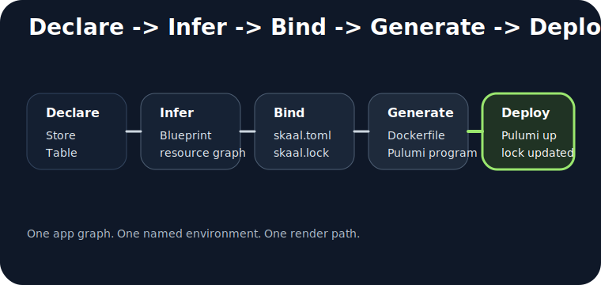
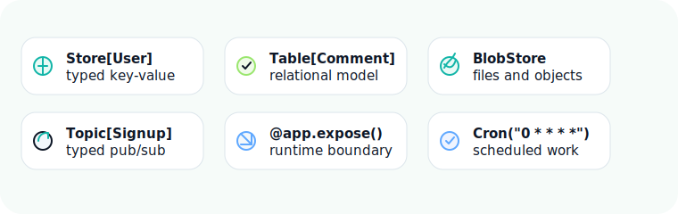
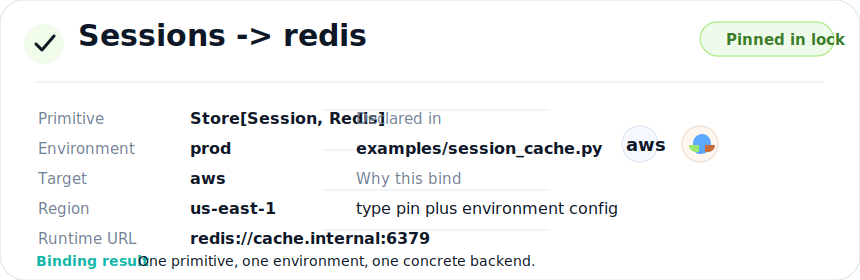
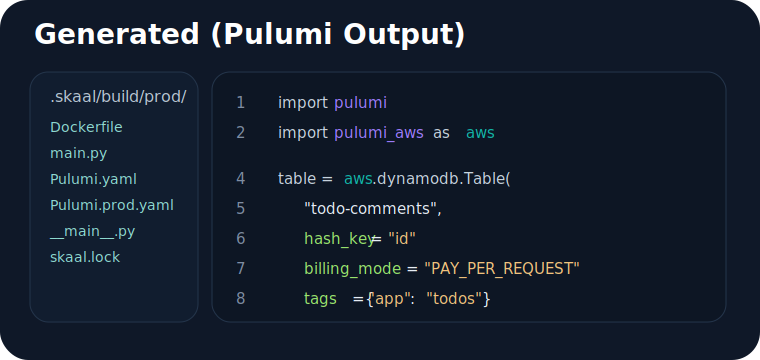

# How it works

Skaal keeps one application model and changes the environment around it. You do not rewrite the app to move from local development to AWS or GCP. You declare the app once, then Skaal infers, binds, renders, and deploys it.



## 1. Declare



You write typed primitives and decorated functions:

- `Store[T]`, `Table`, `BlobStore`, and `Topic[T]` describe state and messaging.
- `@app.expose()`, `@app.schedule(...)`, and `@app.job(...)` describe executable work.
- `app.mount("/", api)` attaches a public ASGI app when you want one.

The app code says what exists. It does not say how to wire Pulumi resources by hand.

## 2. Infer

Calling `app.blueprint()` walks the app graph and produces a **Blueprint**. That blueprint is environment-independent. It names the resources, their kinds, and the source locations that declared them.

What you can inspect:

- `skaal map ... --env local` prints the source-to-resource tree.
- `skaal map` also writes `.skaal/map.json` for machines and CI.

## 3. Bind



The binding layer combines the blueprint with one named environment from `skaal.toml` and any existing pins in `skaal.lock`.

That produces a **Plan** with concrete backend choices, regions, and deploy metadata. The important inputs are:

- the app graph
- `[env.<name>]` in `skaal.toml`
- existing lock entries for that environment

## 4. Generate

`skaal build examples.todo_api:app --env prod` renders deploy artifacts without touching cloud resources. That is the point where you can inspect what Skaal would hand to Pulumi.

What gets written:

- a build directory under `.skaal/build/<env>/` by default
- Dockerfiles and runtime entrypoints
- Pulumi program files and stack metadata

## 5. Deploy




`skaal deploy examples.todo_api:app --env prod` renders again, runs Pulumi through the Automation API, and records new pins in `skaal.lock` when the bind step chose previously unpinned resources.

That means later `skaal plan` runs can answer a simple question: what changed between the current app and the current lock file?

## The command loop

```bash
skaal plan examples.todo_api:app --env local
skaal map examples.todo_api:app --env local
skaal build examples.todo_api:app --env prod
skaal deploy examples.todo_api:app --env prod
```

## What stays stable

Stable across environments:

- your `App`, `Module`, and storage declarations
- your exposed functions and mounted HTTP app
- your business logic and call sites

Environment-specific:

- the selected environment in `skaal.toml`
- backend-specific options and overrides
- region and project settings
- the lock entries for that environment

## What Skaal does not do

- It does not replace your web framework. FastAPI, Starlette, or another ASGI app still owns public HTTP.
- It does not hide the deploy output. `skaal build` writes a real artifact tree you can inspect.
- It does not require `skaal.toml` for local development. When the file is absent, Skaal synthesizes a baseline `local` environment.

## Next

- Read [Concepts](concepts.md) if you want the glossary version.
- Read [What you can build](platform-features.md) for concrete app shapes.
- Read [HTTP integration](http.md) for the mounted ASGI model.
