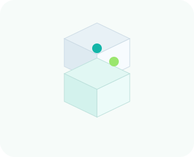

# What you can build

Skaal is for application shapes you already recognize: APIs, jobs, uploads, workers, and data-backed services. The difference is that the app code also declares the infrastructure shape.

## A mounted HTTP API

Use `Store`, `Table`, and `@app.expose()` behind a mounted FastAPI or Starlette app.

Reach for this when you want:

- normal request validation and auth in your web framework
- Skaal-managed data surfaces behind those routes
- one deploy path for local and cloud environments

Start from [Tutorial 2](tutorials/http-api.md) or `examples/todo_api`.

## A scheduled job

Use `@app.schedule(...)` when the app needs periodic work such as compaction, sync, reporting, or cleanup.

Good fit:

- read from a table, write to a store, publish to a topic
- keep the schedule declaration next to the business logic

What it does not do:

- It does not replace a workflow engine. Multi-step orchestration still belongs in application code.

## A worker or fan-out service

Use `Topic[T]` plus exposed functions to publish events and process them in application-owned code.

Good fit:

- signup events
- notifications
- ingest pipelines
- background fan-out work

## A file API

Use `BlobStore` when the app uploads, lists, downloads, and deletes files.

Good fit:

- user uploads
- export bundles
- media or document storage

Start from `examples/file_upload_api` and [Tutorial 5](tutorials/files-and-streaming.md).

## A relational app

Use `Table` when the data model needs SQL queries, transactions, or explicit schema management.

Good fit:

- comment systems
- line-of-business CRUD apps
- data with joins, indexes, and migrations

What it does not do:

- It does not remove schema design. You still need to own your model and migration discipline.

## A streaming endpoint

Use `app.invoke_stream(...)` when the response is an async iterator and your public HTTP layer should stream it as SSE or chunked output.

Good fit:

- token streaming
- progress updates
- long-running request output

See `examples/fastapi_streaming` for the exact pattern.

## A mounted service from another framework

Skaal does not try to replace your web framework. Mount the ASGI app you already want to use and keep Skaal responsible for the app graph, data surfaces, and deploy artifacts.

## Next

- Read [HTTP integration](http.md) for the route boundary.
- Read [Examples](examples.md) for complete repo apps.
- Read [When to use Skaal](when-to-use.md) if you are still deciding whether this is the right tool.
